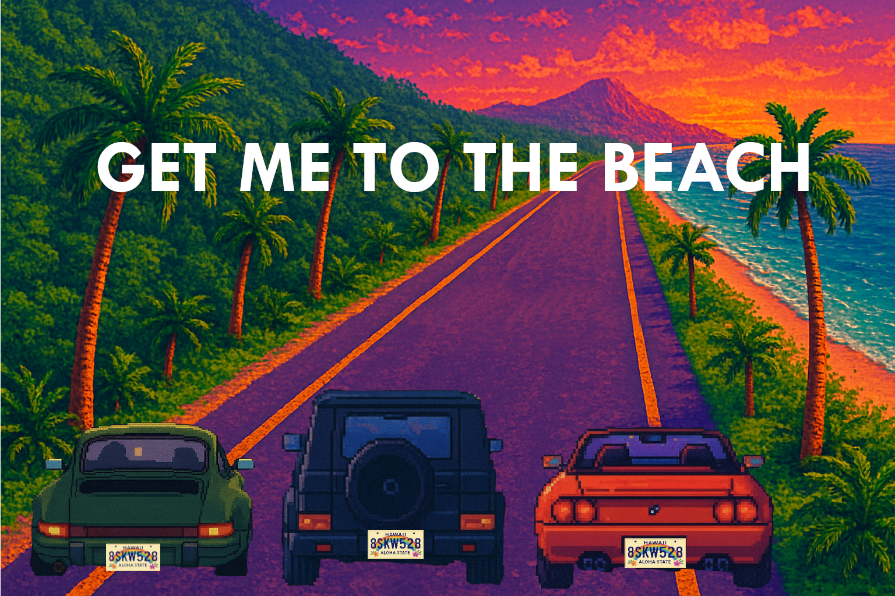

# Get Me to the Beach

  

A retro, Hawaii-themed arcade driving game where you cruise down a sunny coastal road, dodge potholes and fallen palm tree debris, and collect pineapples, surfboards, beach balls, and rare sun coins for extra lives. The goal: make it to the beach without losing all your lifeline.

---

## How to Play

- Press Start
- Choose your vehicle
- Use the left and right arrow keys to move
- Avoid obstacles
- Collect items for extra points
- Reach the beach to win
- Lose all lives and the game ends

---

## Technologies Used

- HTML
- CSS
- JavaScript (DOM manipulation)

---

## Credits

Designed and developed by **Luana Aguilo**.
